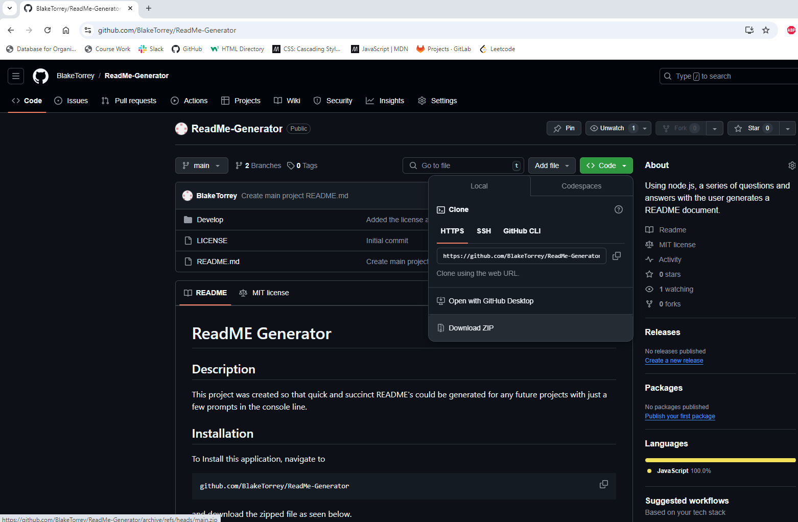
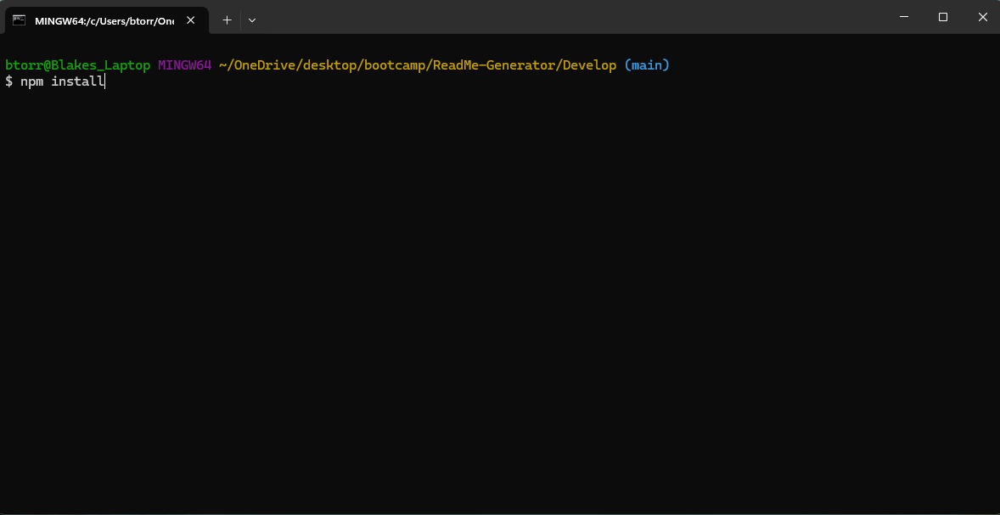
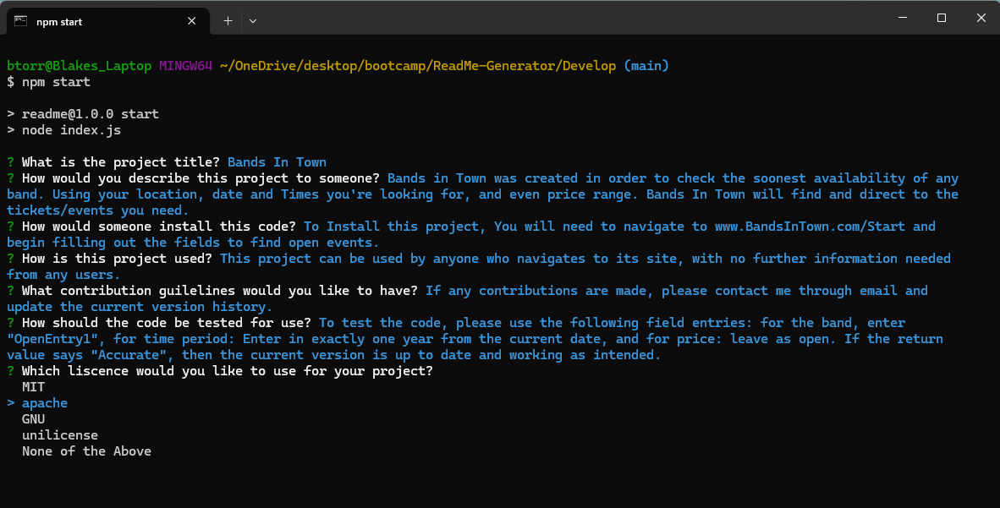

# ReadME Generator

## Description

This project was created so that quick and succinct README's could be generated for any future projects with just a few prompts in the console line.

## Installation

To Install this application, navigate to 

```
github.com/BlakeTorrey/ReadMe-Generator
```

and download the zipped file as seen below.





Once it has been downloaded unzip the file and pull up a console. Navigate to the directory like this:

```md

```

Once you have pulled open the console. Type the following into the console:

```
npm install
```

With this, you have installed everything!

## Usage

If everything has been installed, type the following in the log:

```
npm Start
```

This will begin to run the program and a series of questions will begin to pop up in the console. Answering them will begin the proces of generating your README.

```md

```

Once all of the questions have been answered, A README will appear in the generated folder with your newly created README.

```md

```

## License
[](https://opensource.org/licenses/MIT)


